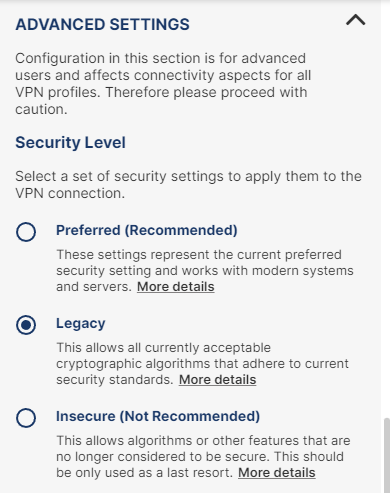

# Содержимое репозитория https://github.com/AndreyChuyan/se_labs

- [Содержимое репозитория https://github.com/AndreyChuyan/se\_labs](#содержимое-репозитория-httpsgithubcomandreychuyanse_labs)
- [Занятость хостов](#занятость-хостов)
- [⏰ Подготовка: 1-2 дня до занятия](#-подготовка-1-2-дня-до-занятия)
  - [Чек-лист подготовки:](#чек-лист-подготовки)
- [🚀 Инструкция по настройке окружения для работы](#-инструкция-по-настройке-окружения-для-работы)
  - [📦 Необходимое ПО и файлы конфигурации](#-необходимое-по-и-файлы-конфигурации)
    - [Visual Studio Code](#visual-studio-code)
      - [💻 Установка VS Code](#-установка-vs-code)
      - [🔌 Установка расширений](#-установка-расширений)
    - [🔐 OpenVPN](#-openvpn)
      - [Установка openVPN для MacOS и Windows](#установка-openvpn-для-macos-и-windows)
      - [Установка на Linux](#установка-на-linux)
    - [📄 OpenVPN Config файл](#-openvpn-config-файл)
  - [🔗 Настройка соединения и подключение к ВМ](#-настройка-соединения-и-подключение-к-вм)
    - [🌐 Подключение к тоннелю](#-подключение-к-тоннелю)
      - [MacOS, Windows (GUI)](#macos-windows-gui)
      - [Linux (terminal)](#linux-terminal)
    - [🖥️ Подключение к ВМ](#️-подключение-к-вм)
      - [🔑 Подключение с помощью пары логин-пароль](#-подключение-с-помощью-пары-логин-пароль)
      - [🔐 Подключение через SSH-ключи](#-подключение-через-ssh-ключи)
        - [Linux/MacOS](#linuxmacos)
          - [Создание своего ключа](#создание-своего-ключа)
          - [Использование ключа, выданного преподавателем (se\_labs)](#использование-ключа-выданного-преподавателем-se_labs)
- [❓ ЧАВО (Часто Задаваемые Вопросы)](#-чаво-часто-задаваемые-вопросы)
  - [🔐 OpenVPN](#-openvpn-1)
    - [⚠️ OpenVPN не подключается / пишет "Connection timeout"](#️-openvpn-не-подключается--пишет-connection-timeout)
    - [⚠️ VPN подключился, но не могу пингануть сервер](#️-vpn-подключился-но-не-могу-пингануть-сервер)
  - [🔌 SSH подключение](#-ssh-подключение)
    - [⚠️ VSCode пишет "Permission denied (publickey,password)"](#️-vscode-пишет-permission-denied-publickeypassword)
    - [⚠️ VSCode пишет "Connection timeout"](#️-vscode-пишет-connection-timeout)
    - [⚠️ При подключении VSCode зависает на "Setting up SSH Host..."](#️-при-подключении-vscode-зависает-на-setting-up-ssh-host)
    - [⚠️ SSH ключ не работает, все равно спрашивает пароль](#️-ssh-ключ-не-работает-все-равно-спрашивает-пароль)
    - [⚠️ Windows не видит команду ssh-keygen](#️-windows-не-видит-команду-ssh-keygen)
    - [⚠️ macOS просит пароль от ключа при каждом подключении](#️-macos-просит-пароль-от-ключа-при-каждом-подключении)
  - [📋 Общие вопросы](#-общие-вопросы)
    - [❔ Забыл свой номер хоста (XX)](#-забыл-свой-номер-хоста-xx)
    - [❔ Можно ли подключиться без VPN?](#-можно-ли-подключиться-без-vpn)
    - [❔ Можно ли использовать другой SSH клиент вместо VSCode?](#-можно-ли-использовать-другой-ssh-клиент-вместо-vscode)
    - [❔ Как отключиться от хоста в VSCode?](#-как-отключиться-от-хоста-в-vscode)
    - [💡 Не нашли ответ?](#-не-нашли-ответ)
  - [🔧 Траблшутинг: пошаговая диагностика](#-траблшутинг-пошаговая-диагностика)
    - [T-1 Проблема с VPN:](#t-1-проблема-с-vpn)
      - [T-1-1 Попробуйте другой конфиг .ovpn если есть](#t-1-1-попробуйте-другой-конфиг-ovpn-если-есть)
      - [T-1-2 Перебрав доступные конфиги переустановите OVPN клиент и попробуйте заново](#t-1-2-перебрав-доступные-конфиги-переустановите-ovpn-клиент-и-попробуйте-заново)
      - [T-1-3 Проверьте чтобы был настроен нужный режим в настройках клиента](#t-1-3-проверьте-чтобы-был-настроен-нужный-режим-в-настройках-клиента)
    - [T-2 Проблема с VM](#t-2-проблема-с-vm)
      - [T-2-1 Подключение к VM](#t-2-1-подключение-к-vm)
      - [T-2-2 SSH подключение](#t-2-2-ssh-подключение)
    - [T-3 Проблема с VSCode:](#t-3-проблема-с-vscode)
      - [T-3-1 Если терминал работает, а VSCode нет → переустановите расширение Remote-SSH](#t-3-1-если-терминал-работает-а-vscode-нет--переустановите-расширение-remote-ssh)
- [✨ **Успехов в выполнении лабораторных работ!**](#-успехов-в-выполнении-лабораторных-работ)
  - [👤 Автор](#-автор)

# Занятость хостов

| №   | Преподаватель               | Диапазон IP-адресов |
| --- | --------------------------- | ------------------- |
| 1   | se_docker_Maks_Tachkov      | 192.168.2.100-119   |
| 2   | se_openapi_Valeriy_Zubairov | 192.168.2.150-169   |
| 3   | se_kafka_Sergey_Bulatov     | 192.168.2.170-189   |
| 4   | se_prometheus_Andrey_Chuyan | 192.168.2.80-99     |

# ⏰ Подготовка: 1-2 дня до занятия

⚠️ **Подготовка КРИТИЧНА!** На прошлом проведении те, кто готовился в последний день, столкнулись с SSH перебоями и замедлили всю группу. Те, кто подготовился заранее, прошли материал без запинок.

**Почему ранняя подготовка:**
1. SSH/VPN проблемы требуют времени на диагностику
2. Первый запуск контейнеров нужно дать стабилизироваться
3. Преподаватель не сможет помочь всем одновременно на занятии
4. Время на лабе уходит на учебу, а не на настройку


## Чек-лист подготовки:

**День 1 — Локальная подготовка:**
- [ ] Установить OpenVPN (Windows / MacOS / Linux)
- [ ] Установить VS Code и расширения (Remote SSH, Container Tools)
- [ ] Получить .ovpn конфиг и сохранить его
- [ ] Подключиться к VPN и убедиться, что работает

**День 2 — Проверка доступа к ВМ:**
- [ ] Проверить пинг до своей ВМ: `ping 192.168.2.XX` (ваш номер из таблицы)
- [ ] Подключиться по SSH с логином-паролем
- [ ] Проверить Docker: `docker --version`

**День 3 — Финальная проверка перед лабой:**
- [ ] Запустить все необходимые сервисы (см. инструкцию в папке вашей лабораторной)
- [ ] Проверить доступ ко всем портам
- [ ] Убедиться, что все работает без ошибок
- [ ] Написать в чат: "✅ Готов к занятию"

---

# 🚀 Инструкция по настройке окружения для работы
В этом файле описаны шаги, которые нужно выполнить для комфортного выполнения работы на виртуальной машине (ВМ) Systems.Education
## 📦 Необходимое ПО и файлы конфигурации
### Visual Studio Code 
VS Code – текстовый редактор с множеством расширений для удобной работы с кодом и процессами разработки. Мы его будем использовать для написания необходимых для лабораторной работы скриптов.
#### 💻 Установка VS Code 
1. Скачайте VS Code [по ссылке](https://code.visualstudio.com/download)
1. Установите редактор
#### 🔌 Установка расширений
1. Установите расширение [Remote - SSH](https://marketplace.visualstudio.com/items?itemName=ms-vscode-remote.remote-ssh). С помощью него мы подключимся по SSH к ВМ и сможем работать с файлами так, будто они расположены локально.
1. Установите расширение [Container tools](https://marketplace.visualstudio.com/items?itemName=ms-azuretools.vscode-containers). Это расширение упрощает работу с контейнерами, позволяет удобно читать их логи.
Вы можете установить эти расширения, перейдя во вкладку "Расширения" ("Extensions") в левом боковом меню (1 на скрине) и вбив в поисковкую строку (2) "Remote - SSH" (3), "Container Tools" (4)


### 🔐 OpenVPN
OpenVPN – ПО для настройки VPN-тоннеля для подключения к ВМ. 
#### Установка openVPN для MacOS и Windows
1. Скачайте с сайта [openvpn.net](https://openvpn.net/client/) необходимый установочный файл.
2. Установите приложение
3. Возможно в брандмауэре Windows необходимо будет разрешить доступ для OpenVPN (галочки и для Private, и для Public сетей), а в MacOS нужно будет согласиться внести изменение в конфигурацию сети. Это может понадобиться при первом подключении
#### Установка на Linux
1. Выполните шаги по инструкции на [сайте](https://openvpn.net/community-docs/openvpn-client-for-linux.html)
### 📄 OpenVPN Config файл
1. Сохраните .ovpn-файл, который вам передал преподаватель, на компьютер
## 🔗 Настройка соединения и подключение к ВМ
Для подключения нужно будет выполнить следующие шаги:
1. Подключение к vpn-тоннелю
2. Подключение к виртуальной машине в VS Code
### 🌐 Подключение к тоннелю
#### MacOS, Windows (GUI)
1. Запустите OpenVPN Connect
2. File → Import → From local file → выберите .ovpn-файл, сохранённый на этапе подготовки к выполнению работы
3. Нажмите Connect
#### Linux (terminal)
1. Выполните команду ```sudo openvpn --config {путь к .ovpn-файлу}```
### 🖥️ Подключение к ВМ
Подключиться к ВМ по SSH можно с помощью пары логин-пароль и с помощью ssh-ключей. Ниже описаны оба способа, как это можно сделать. Для начала можно настроить подключение через логин, а затем добавить ключ и немного поменять конфиг.
#### 🔑 Подключение с помощью пары логин-пароль

1. Перейдите в VS Code
2. В левом нижнем углу найдите иконку с двумя треугольными скобками "Open a Remote Window" (1 на скриншоте)
3. В появившемся меню выберите пункт "Connect to Host" (2 на скриншоте)

4. Если вы еще не настраивали подключение к этой ВМ, то выберите "Add New SSH Host"

5. В поле для ввода наберите ```ssh linux@<ip-адрес, указанный преподавателем>```

6. Далее выберите файл для конфигурации

7. В появившемся справа снизу уведомлении нажмите "открыть файл"

8. Вы увидите заполненную конфигурацию

9. Проверьте, что конфигурация похожа на указанную ниже (вместо HOST может быть указан ip-адрес, можете изменить на человекочитаемое имя, в примере я указал se_labs_user). Убедитесь, что IP-адрес в HostName совпадает с переданным преподавателем
```
Host se_labs_user
  HostName <ip-адрес виртуальной машины>
  User linux
  StrictHostKeyChecking no
  UserKnownHostsFile /dev/null
```
10. Снова нажмите на иконку со скобками (как в п. 2)
11. Выберите "Connect to Host"
12. Выберите добавленный хост
13. Откроется новое окно VS Code с фиолетовой нижней панелью

14. При запросе пароля введите переданный преподавателем пароль
15. Если все прошло корректно, то во вкладке **TERMINAL** в нижней панели вы увидете строку консоли `linux@localhost:~$` 

#### 🔐 Подключение через SSH-ключи
Для подключения с помощью ключей необходимо получить или сгенерировать ключ на локальной машине, а затем публичную часть ключа добавить на сервер с ВМ. Ниже инструкции. 

##### Linux/MacOS

###### Создание своего ключа
1. Откройте терминал в VS Code (Terminal -> New Terminal)
2. Выполните команду ```ssh-keygen -t rsa -b 4096 -C "your_email@example.com"```
3. Укажите расположение ключа или сразу нажмите Enter для расположения по умолчанию (~/.ssh/id_rsa). Лучше указать расположение вручную и указать имя, чтобы не запутаться в ключах
4. Введите passphrase для установки кода для доступа к ключу или нажмите Enter (чтобы не вводить каждый раз)
5. Повторите passphare
6. Вы увидите, куда сохранился ключ

📚 Подробнее о настройке можно почитать в [статье](https://code.visualstudio.com/docs/remote/ssh#_remember-hosts-and-advanced-settings)

Теперь нам нужно скопировать публичный ключ на сервер с виртуальной машиной. Для этого:
1. Выполните команду ```ssh-copy-id -i <путь к публичному ключу из п.6 в пред-ем шаге> <логин>@<ip-адрес ВМ>```
   **Если у вас Windows, то необходимо выполнить шаги ниже:**
    1. Выполните команду ```type $env:USERPROFILE\<путь к публичному ключу>.pub```
    2. Подключитесь к ВМ, выполнив команду ```ssh linux@<ip-адрес ВМ>```
    3. Введите пароль, переданный преподавателем
    4. Создайте директорию, выполнив команду ```mkdir -p ~/.ssh```
    5. Добавьте публичный ключ с помощью команды ```echo "ВАШ_ПУБЛИЧНЫЙ_КЛЮЧ" >> ~/.ssh/authorized_keys```
    6. Поменяйте права доступа ```chmod 600 ~/.ssh/authorized_keys```
    7. Завершите подключение с помощью ```exit```
2. Введите пароль от ВМ, переданный преподавателем (НЕ Pass phrase из п.4 пред-го шага)
3. Если у вас MacOS, выполните команду ```ssh-add --apple-use-keychain <путь к публичному ключу из п.6 в пред-ем шаге>```
4. Если вы уже добавляли хост для подключения через логин пароль, то откройте конфигурационный файл
  1. Треугольные скобки
  2. Connect to Host
  3. Configure SSH Hosts
  4. Выберите конфигурационный файл, который настраивали
  5. Добавьте строку ```  IdentityFile ~/.ssh/se_labs```
В итоге ваш конфигурационный файл должен выглядеть так: 

```bash
Host se_labs_user
  HostName <ip-адрес виртуальной машины>
  User linux
  StrictHostKeyChecking no
  UserKnownHostsFile /dev/null
  IdentityFile ~/.ssh/se_labs
```
6. ✅ Готово, теперь вы можете подключаться без пароля с помощью ключа
🔗 Подробнее про настройку RemoteSSH: https://code.visualstudio.com/docs/remote/ssh

###### Использование ключа, выданного преподавателем (se_labs)


Разместить ключ в диретории `~/.ssh/se_labs`

Для Linux создать соответсвующие права: 

`chmod 600 ~/.ssh/se_labs`

В итоге ваш конфигурационный файл должен выглядеть так: 

```bash
Host se_labs_user
  HostName <ip-адрес виртуальной машины>
  User linux
  StrictHostKeyChecking no
  UserKnownHostsFile /dev/null
  IdentityFile ~/.ssh/se_labs
```

Если все верно настроено, вы подключитесь к виртуальной машине без пароля

---


# ❓ ЧАВО (Часто Задаваемые Вопросы)

## 🔐 OpenVPN

### ⚠️ OpenVPN не подключается / пишет "Connection timeout"

- Проверьте, что вы в той же сети, что и сервер
- Убедитесь, что OpenVPN разрешен в брандмауэре
- Попробуйте запустить OpenVPN от имени администратора

### ⚠️ VPN подключился, но не могу пингануть сервер

- Проверьте команду `ipconfig` (Windows) или `ip a` (Linux) — должен появиться адаптер с IP из диапазона 10.8.0.X
- Попробуйте `ping 192.168.2.1XX` — если не работает, переподключите VPN

## 🔌 SSH подключение

### ⚠️ VSCode пишет "Permission denied (publickey,password)"

- Проверьте правильность пароля (должен быть linux)
- Убедитесь, что VPN подключен
- Проверьте правильность IP адреса хоста

### ⚠️ VSCode пишет "Connection timeout"

- Убедитесь, что OpenVPN успешно подключен
- Проверьте правильность IP адреса (192.168.2.1XX)
- Попробуйте пинговать хост: `ping 192.168.2.1XX`

### ⚠️ При подключении VSCode зависает на "Setting up SSH Host..."

- Нажмите Ctrl+C в терминале VSCode и попробуйте снова
- Перезапустите VSCode
- Удалите папку ~/.vscode-server на удаленном хосте (подключитесь через обычный терминал и выполните `rm -rf ~/.vscode-server`)

### ⚠️ SSH ключ не работает, все равно спрашивает пароль

- Проверьте права на файлы:
- `chmod 700 ~/.ssh`
- `chmod 600 ~/.ssh/id_rsa`
- `chmod 644 ~/.ssh/id_rsa.pub`
- Убедитесь, что публичный ключ добавлен в `~/.ssh/authorized_keys` на сервере
- Проверьте права на authorized_keys: `chmod 600 ~/.ssh/authorized_keys`

### ⚠️ Windows не видит команду ssh-keygen

- Используйте PowerShell вместо CMD
- Или установите Git Bash: https://git-scm.com/downloads
- Или обновите Windows до последней версии

### ⚠️ macOS просит пароль от ключа при каждом подключении

Выполните:
```bash
ssh-add --apple-use-keychain ~/.ssh/id_rsa
```

## 📋 Общие вопросы

### ❔ Забыл свой номер хоста (XX)

- Обратитесь к преподавателю

### ❔ Можно ли подключиться без VPN?

- Нет, сначала необходимо установить VPN соединение

### ❔ Можно ли использовать другой SSH клиент вместо VSCode?

- Да, можно использовать любой SSH клиент (PuTTY, встроенный ssh в терминале и т.д.), но для лабораторных работ рекомендуется VSCode, это поможет нам быстрее разобраться с ошибками и проблемами

### ❔ Как отключиться от хоста в VSCode?

- File → Close Remote Connection (или нажмите на зеленую кнопку в левом нижнем углу → Close Remote Connection)

### 💡 Не нашли ответ?

- Обратитесь к преподавателю или в чат группы

---

## 🔧 Траблшутинг: пошаговая диагностика

Если ничего не работает, проверяйте по порядку:

### T-1 Проблема с VPN:
   
#### T-1-1 Попробуйте другой конфиг .ovpn если есть

#### T-1-2 Перебрав доступные конфиги переустановите OVPN клиент и попробуйте заново

#### T-1-3 Проверьте чтобы был настроен нужный режим в настройках клиента




### T-2 Проблема с VM

#### T-2-1 Подключение к VM

```bash
ping 192.168.2.3
```

#### T-2-2 SSH подключение

```bash
ssh linux@192.168.2.XXX
```

### T-3 Проблема с VSCode:

#### T-3-1 Если терминал работает, а VSCode нет → переустановите расширение Remote-SSH

---

# ✨ **Успехов в выполнении лабораторных работ!**

---

## 👤 Автор

[Dbgops](https://chuyana.ru)

```bash
 _     _ 
  \___/    SE_Labs
 ( ^_^ )   
 /| o |\   🐞 Dbgops
 /|___|\   by Andrey Chuyan
 _/  \_    https://chuyana.ru
```
